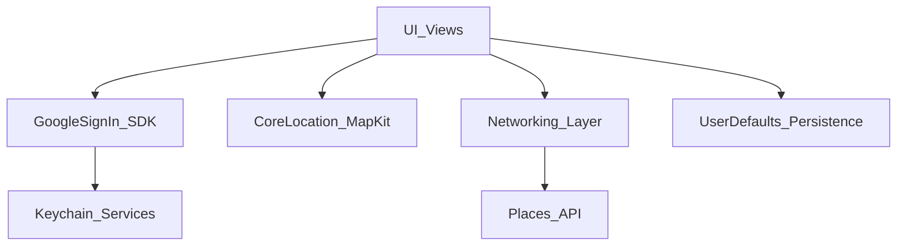
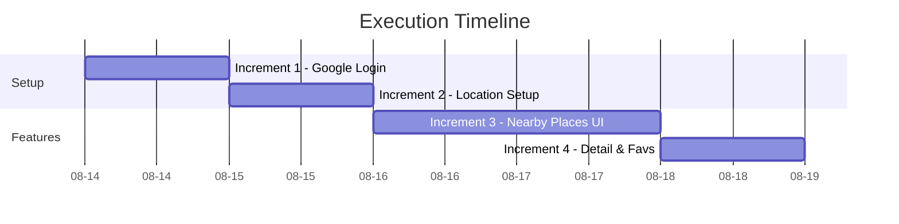

# Charter: Nearby Places Explorer Core Flow

> **Verdict:** Ready
> **Criticality:** High
> **Date:** 2026-08-14

---

## 1) Executive Summary

Evaluation of the core Nearby Places Explorer functional flow (Login, Map/List View, Detail View). The requirements are clear, UI mockups are provided, and technical constraints (sync vs async API calls, local persistence) are explicitly defined. The work is ready for implementation pending confirmation of API credentials.

---

## 2) Plan Reference

| Field | Value |
|-------|-------|
| **Plan file** | N/A |
| **Tracker ticket(s)** | N/A |
| **Planning mode** | N/A |

---

## 3) Readiness Assessment

| DoR Dimension | Status | Gaps |
|---------------|--------|------|
| Functional | Complete | None |
| Non-Functional | Complete | None |
| Technical | Partial | Need explicit API provider details. Must use Keychain for auth tokens. |
| Test Cases | Missing | Missing explicit test acceptance criteria, but implicit in requirements. |
| Resources & Access | Partial | Need Google Client ID for Sign-In and API Key for Places. |

### Open Questions (if any)

- **Critical:** Which public API should be used for nearby places? Are the API keys and Google Sign-In Client ID available?
- **Important:** For the synchronous/blocking API call in View 3, should we explicitly block the main thread to demonstrate the effect, or execute synchronously on a background thread?

---

## 4) Effort Estimation

| Increment | Complexity | Size | Confidence | Rationale |
|-----------|------------|------|------------|-----------|
| 1. Authentication (Google Sign-In) | Med | S | High | GoogleSignIn SDK integration. Requires secure token storage via Keychain. |
| 2. Map & Location Services | Med | M | High | MapKit integration and CoreLocation permissions are well documented. |
| 3. Nearby API & Map/List UI (Async) | Med | M | High | Async/await fetch with loading state and Map annotations / List switch. |
| 4. Detail API (Sync) & Favorites | Med | M | High | Intentional sync call, UserDefaults for favorites persistence, geographic distance calculation. |
| **Total** | — | L | High | — |

---

## 5) Viability Analysis

### Technical Viability
Completely viable on iOS. GoogleSignIn SDK handles auth, and iOS Keychain Services will be used to securely persist the session token. MapKit provides mapping. `URLSession` handles both the async/await calls and synchronous (via semaphore or sync methods) requests. UserDefaults is strictly used for non-sensitive data (like simple Favorites persistence).

### Organizational Viability
N/A (Local project)

### Scope Viability
The scope is realistic and directly corresponds to a standard technical assessment or core MVP. The 4 increments provide a clear path to completion.

---

## 6) Impact Analysis

### Technical Impact
Establishes the core architecture for the app: Networking layer, Location Services, and Authentication boundaries.

### Business Impact
Delivers the complete end-to-end user journey defined in the core functional flow.

### Organizational Impact
N/A

---

## 7) Dependencies & Risks

### Dependencies

| Dependency | Type | Status | Notes |
|------------|------|--------|-------|
| Google Sign-In SDK | Technical | Pending | Needs SPM integration and Client ID |
| Keychain Services | Technical | Available | Native iOS Security framework for secure auth token storage |
| Places API | External | Pending | Needs API Key and endpoint selection |
| CoreLocation / MapKit | Technical | Available | Native iOS frameworks |

### Risks

| Risk | Type | Level | Mitigation |
|------|------|-------|------------|
| Synchronous API Call (View 3) | performance | Medium | If executed on the main thread, the OS watchdog may terminate the app if the network is too slow. Mitigation: Execute the blocking call on a background thread, or keep it explicitly brief if the goal is to demonstrate main-thread blocking UI behavior. |
| Location Permissions Denied | edge-case | Low | The app needs a fallback or clear error message if the user denies location permissions on View 2. |

---

## 8) Dependency Map

---

## 9) Execution Timeline

---

## 10) Recommendation

**Verdict:** Ready

The requirements are highly structured and ready for implementation. The technical approach is fully viable. We must secure the Google Sign-In Client ID and the Places API key before beginning the networking implementations.
