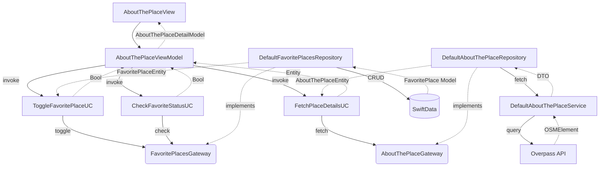

## Problem Framing
Currently, the `AboutThePlaceView` module contains only boilerplate code and an empty placeholder interface. We need to implement a full detail screen that dynamically fetches precise place data (rating, opening hours, exact location) from the Overpass API using a provided `osmId`, while simultaneously supporting offline persistence to mark places as favorites utilizing SwiftData. This matters because it bridges the discovery phase (Nearby Places) with actionable engagement (saving a location), providing the core value loop for the user. The desired behavior is a responsive UI that displays a blocking loading overlay while fetching, transitions smoothly to a loaded state with a non-interactive map and dynamically populated information boxes, handles network errors gracefully with standardized alerts, and accurately toggles the favorite status directly to the local SwiftData store.

## Architecture and Approach

- **Pattern:** Clean Architecture (Data, Domain, Presentation layers) with MVVM and SwiftUI Observation.
- **Data Layer (Network):** `DefaultAboutThePlaceService` implements `APIRequestDispatching` to construct and execute the `[out:json][timeout:25]; node(id); out body;` query against Overpass API. Parses the result into `OSMElement` DTO.
- **Data Layer (Caching):** An in-memory `NSCache` inside `DefaultAboutThePlaceRepository` will store fetched `AboutThePlaceEntity` objects mapped by `osmId`, preventing redundant API calls when revisiting a place during the same session.
- **Data Layer (Persistence):** `DefaultFavoritePlacesRepository` interacts with the SwiftData `ModelContext` to query, insert, or delete `FavoritePlace` models mapped by `userEmail` and `osmId`.
- **Domain Layer (Use Cases):** `FetchPlaceDetailsUC` orchestrates the network fetch via `AboutThePlaceGateway`. `ToggleFavoritePlaceUC` and `CheckFavoriteStatusUC` orchestrate the local SwiftData persistence via `FavoritePlacesGateway`.
- **Presentation Layer:** `AboutThePlaceViewModel` holds the view state (`idle`, `loading`, `loaded`, `error`, `empty`) and orchestrates the Use Cases. It maps domain entities to a new presentation model `AboutThePlaceDetailModel`.
- **UI & Navigation:** Transition from `NearbyPlaces` providing `osmId`, `name`, and basic data. The view lifecycle triggers `viewModel.onAppear()` to load the details.
- **State Consistency (Persistence):** The Favorite button in both the bottom safe area and the Navigation Toolbar must react instantly to the underlying `isFavorite` state in the ViewModel, avoiding lag or mismatch.
- **INV-001 — Blocking UX:** A translucid overlay with `ProgressView` (red tint) MUST intercept user interactions while the `FetchPlaceDetailsUC` is in flight.
- **INV-002 — View Reusability:** The Map component MUST be locked with `.disabled(true)` or `.allowsHitTesting(false)` to keep it strictly informational and lightweight.
- **BND-001 — Domain Isolation:** SwiftData (`@Model`) and CoreData logic MUST remain in the Data layer; Domain layer should only know about pure Swift structs (`FavoritePlaceEntity`).
- **OWN-001 — Auth Ownership:** The `userEmail` required for SwiftData persistence MUST be injected securely, ideally from the active session or a secure keychain wrapper, rather than manually typed.
- **FAIL-001 — Network Failure:** Network errors or empty responses MUST trigger the specific exact alert string implemented in `NearbyPlacesView` to maintain product consistency.
- **FAIL-002 — Missing Data Fallback:** Optional OSM tags (like `opening_hours` or ratings) that return nil MUST trigger a visual fallback matching the UI layout symmetry (e.g., "N/D", "Horario no disponible").

## File Structure and Visualization

### Files to create
- `GS-NearbyPlacesExplorer/Features/AboutThePlace/Data/Models/FavoritePlace.swift` (SwiftData Model)
- `GS-NearbyPlacesExplorer/Features/AboutThePlace/Data/Repositories/DefaultFavoritePlacesRepository.swift`
- `GS-NearbyPlacesExplorer/Features/AboutThePlace/Data/Repositories/DefaultAboutThePlaceRepository.swift`
- `GS-NearbyPlacesExplorer/Features/AboutThePlace/Domain/Entities/AboutThePlaceEntity.swift`
- `GS-NearbyPlacesExplorer/Features/AboutThePlace/Domain/Entities/FavoritePlaceEntity.swift`
- `GS-NearbyPlacesExplorer/Features/AboutThePlace/Domain/Gateways/AboutThePlaceGateway.swift`
- `GS-NearbyPlacesExplorer/Features/AboutThePlace/Domain/Gateways/FavoritePlacesGateway.swift`
- `GS-NearbyPlacesExplorer/Features/AboutThePlace/Domain/UseCases/FetchPlaceDetailsUC.swift`
- `GS-NearbyPlacesExplorer/Features/AboutThePlace/Domain/UseCases/ToggleFavoritePlaceUC.swift`
- `GS-NearbyPlacesExplorer/Features/AboutThePlace/Domain/UseCases/CheckFavoriteStatusUC.swift`
- `GS-NearbyPlacesExplorer/Features/AboutThePlace/Presentation/Model/AboutThePlaceDetailModel.swift`
- `GS-NearbyPlacesExplorerTests/Features/AboutThePlace/Presentation/AboutThePlaceViewModelTests.swift`
- `GS-NearbyPlacesExplorerTests/Features/AboutThePlace/Data/DefaultAboutThePlaceServiceTests.swift`

### Files to modify
- `GS-NearbyPlacesExplorer/GS-NearbyPlacesExplorer/App/GS_NearbyPlacesExplorerApp.swift` (Add FavoritePlace to schema)
- `GS-NearbyPlacesExplorer/Features/AboutThePlace/Presentation/View/AboutThePlaceView.swift`
- `GS-NearbyPlacesExplorer/Features/AboutThePlace/Presentation/ViewModel/AboutThePlaceViewModel.swift`
- `GS-NearbyPlacesExplorer/Features/AboutThePlace/Data/DataSource/Services/DefaultAboutThePlaceService.swift`
- `GS-NearbyPlacesExplorer/Features/NearbyPlaces/Presentation/View/NearbyPlacesView.swift` (NavigationLink integration)

### Dependencies to verify/add
- `SwiftData` (Native)
- `MapKit` (Native)

### Architecture and flow diagrams

