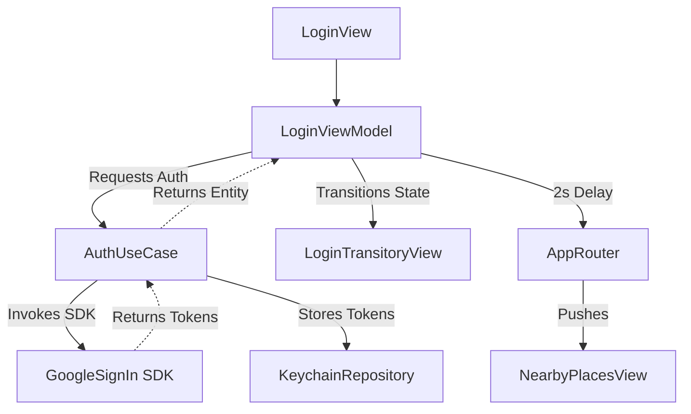
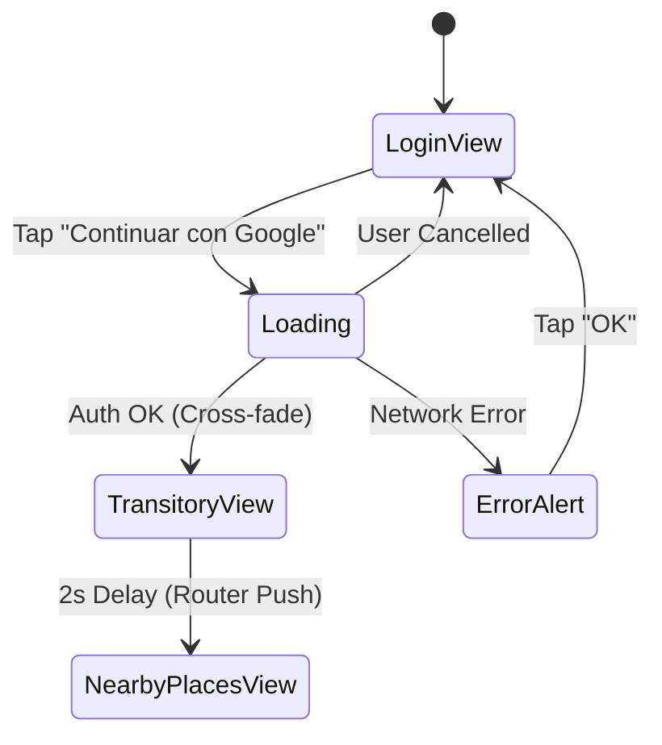

## Problem Framing
- We need to implement a Google SignIn flow for the application using SwiftUI and the GoogleSignIn SDK via SPM.
- This matters because it provides the primary authentication gateway for the user to access the app's core features securely.
- Currently, there is no login logic; the desired behavior is an authenticated state that securely stores the session in Keychain and navigates smoothly (cross-fade) to the next view after displaying the user's profile for 2 seconds.

## Architecture and Approach

- **Pattern:** MVVM with Clean Architecture + SwiftUI Navigation Router.
- **Layers involved:**
  - **Presentation:** `LoginView` (SwiftUI), `LoginTransitoryView`, `LoginViewModel` (State management, error handling, 2s timer), `AppRouter` (Navigation management via `NavigationPath`).
  - **Domain:** `AuthUseCase` (Coordinates Google SignIn logic).
  - **Data:** `KeychainRepository` (Secure persistence of session tokens).

### Architecture Flow Diagram


### User Flow Diagram


- **Dependencies to verify/add:**
  - `GoogleSignIn` (via Swift Package Manager).

- **Plan Obligations:**
  - `INV-001` (Security): Session tokens MUST be stored securely in Keychain, never in UserDefaults or plain text.
  - `INV-002` (UX Timing): The profile display post-login MUST last exactly 2 seconds before navigating.
  - `BND-001` (Architecture): The `GoogleSignIn` SDK import MUST NOT leak into the Presentation layer. `AuthUseCase` abstracts it.
  - `OWN-001` (State): `LoginViewModel` is the sole source of truth for the View's state (Idle, Loading, Success, Error). `AppRouter` is the sole source of truth for navigation state.
  - `FAIL-001` (Network): A network error MUST yield the specific alert "Error de red. Inténtalo de nuevo."
  - `FAIL-002` (Cancellation): User cancellation MUST return the view silently to the initial state without errors.

## File Structure and Visualization

### Files to Create
- `GS-NearbyPlacesExplorer/AppCore/Navigation/AppRouter.swift`
- `GS-NearbyPlacesExplorer/Features/Login/Data/Repositories/KeychainRepository.swift`
- `GS-NearbyPlacesExplorer/Features/Login/Domain/UseCases/AuthUseCase.swift`
- `GS-NearbyPlacesExplorer/Features/Login/Presentation/ViewModels/LoginViewModel.swift`
- `GS-NearbyPlacesExplorer/Features/Login/Presentation/Views/LoginView.swift`
- `GS-NearbyPlacesExplorer/Features/Login/Presentation/Views/LoginTransitoryView.swift`
- `GS-NearbyPlacesExplorerTests/Features/Login/Data/KeychainRepositoryTests.swift`
- `GS-NearbyPlacesExplorerTests/Features/Login/Domain/AuthUseCaseTests.swift`
- `GS-NearbyPlacesExplorerTests/Features/Login/Presentation/LoginViewModelTests.swift`

### Files to Modify
- `GS-NearbyPlacesExplorer.xcodeproj/project.pbxproj` (Add SPM Dependency)
- `GS-NearbyPlacesExplorer/AppCore/App/GS_NearbyPlacesExplorerApp.swift` (Inject `AppRouter` and setup `NavigationStack`)

### Directory Tree Visualization
```text
GS-NearbyPlacesExplorer/
└── Features/
    └── Login/
        ├── Data/
        │   └── Repositories/
        │       └── KeychainRepository.swift
        ├── Domain/
        │   └── UseCases/
        │       └── AuthUseCase.swift
        └── Presentation/
            ├── Views/
            │   ├── LoginView.swift
            │   └── LoginTransitoryView.swift
            └── ViewModels/
                └── LoginViewModel.swift
```
