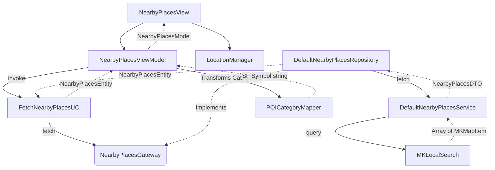

## Problem Framing
Currently, the "Vista 2" (Nearby Places View) exists only as boilerplate files. We need to build a dynamic Map and List exploration interface that consumes MapKit (`MKLocalSearch`) and CoreLocation to help users discover nearby points of interest. This matters because it provides the core value proposition of the app: seamless and immediate local discovery. The desired behavior is a searchable `TabView` that retains its state across tabs, prevents concurrent network race conditions via an overlay, handles permissions gracefully, and relies on a strict static visual mapper to render SF Symbols based on the category.

## Architecture and Approach

- **Pattern:** Clean Architecture (Data, Domain, Presentation layers) with MVVM and SwiftUI Observation.
- **Async model:** Swift 5.7+ `async/await` for MapKit searches and location fetching.
- **Location Management:** A dedicated `@Observable` `LocationManager` wrapping `CLLocationManager` in the AppCore module.
- **Data Layer:** `DefaultNearbyPlacesService` encapsulates `NearbyPlacesAPIRouter` (via `https://overpass-api.de/api/interpreter`) using the `APIRequestDispatcher` and returns `NearbyPlacesDTO` parsed from `OSMElement`. `DefaultNearbyPlacesRepository` maps DTOs to Domain `NearbyPlacesEntity`.
- **Domain Layer:** `FetchNearbyPlacesUC` is the Use Case invoked by the ViewModel to retrieve entities via the `NearbyPlacesGateway` interface.
- **Authentication Initialization:** `HasStoredSessionUC` orchestrates silent background session validation during app launch to prevent UI flickering on the Login screen.
- **Network Configuration:** Overpass API URLs are supplied via `Debug.xcconfig` / `Release.xcconfig` and consumed by `AppConfiguration`. The `User-Agent` is managed centrally by `APIConfiguration`.
- **Presentation Layer:** `NearbyPlacesViewModel` holds the search state (`query`, `results`, `isLoading`), mapping `NearbyPlacesEntity` to `NearbyPlacesModel`. The view layer remains completely decoupled from `MKMapItem`.
- **Navigation & Search Architecture (iOS 18+):** Currently `TabView` is the root container and wraps `NavigationStack` per tab. The Search Tab (`role: .search`) preserves the previous content context (`lastContentTab`) and utilizes `.searchable(isPresented:)` natively. The searchable placeholder is "Buscar lugares cercanos".
- **Routing Strategy:** The list handles routing to `AboutThePlaceView` using `NavigationLink`, while the map markers use another strategy to achieve the same goal. When pushing to the detail view, the tab bar is explicitly hidden.
- **State Consistency (Map):** The map utilizes `MapCameraPosition` to prevent "zoom out" resets when the view hierarchy shifts. State is shared seamlessly between the Map Tab and Search Tab overlays.
- **State Consistency (List):** Scroll position synchronization across instances relies on local view anchors tracking visible indices, avoiding infinite loops caused by inactive views overwriting global state.
- **INV-001 — Blocking UX:** A translucid overlay with `ProgressView` MUST intercept user interactions while the Use Case is in flight.
- **INV-002 — State Consistency:** Tab selection changes MUST NOT refetch data or clear the current search results in the ViewModel.
- **BND-001 — Mapper Decoupling:** `MKPointOfInterestCategory` mapping MUST be handled by a dedicated non-UI utility (`POICategoryMapper`). UI Views MUST NOT contain explicit category to symbol mapping.
- **OWN-001 — Location Ownership:** `LocationManager` is the single source of truth for location permissions and coordinates.
- **OWN-002 — Data Fetching Ownership:** `DefaultNearbyPlacesService` is the sole orchestrator of `MKLocalSearch` requests.
- **FAIL-001 — Missing Location:** Location permission denial MUST trigger the specific "Ubicación necesaria" alert.
- **FAIL-002 — Network Failure:** Network errors or empty responses MUST trigger the specific exact strings defined by product.

## File Structure and Visualization

### Files to create
- `GS-NearbyPlacesExplorer/AppCore/Location/LocationManager.swift`
- `GS-NearbyPlacesExplorer/AppCore/Utils/POICategoryMapper.swift`
- `GS-NearbyPlacesExplorer/Features/NearbyPlaces/Presentation/View/Components/NearbyPlacesMapView.swift`
- `GS-NearbyPlacesExplorer/Features/NearbyPlaces/Presentation/View/Components/NearbyPlacesListView.swift`
- `GS-NearbyPlacesExplorer/Features/NearbyPlaces/Presentation/View/Components/PlaceListCell.swift`
- `GS-NearbyPlacesExplorerTests/Features/NearbyPlaces/Presentation/NearbyPlacesViewModelTests.swift`
- `GS-NearbyPlacesExplorerTests/AppCore/Utils/POICategoryMapperTests.swift`

### Files to modify
- `GS-NearbyPlacesExplorer/Info.plist`
- `GS-NearbyPlacesExplorer/Features/NearbyPlaces/Data/DataSource/Services/DefaultNearbyPlacesService.swift`
- `GS-NearbyPlacesExplorer/Features/NearbyPlaces/Data/Repositories/DefaultNearbyPlacesRepository.swift`
- `GS-NearbyPlacesExplorer/Features/NearbyPlaces/Data/Models/NearbyPlacesDTO.swift`
- `GS-NearbyPlacesExplorer/Features/NearbyPlaces/Domain/Entities/NearbyPlacesEntity.swift`
- `GS-NearbyPlacesExplorer/Features/NearbyPlaces/Domain/Gateways/NearbyPlacesGateway.swift`
- `GS-NearbyPlacesExplorer/Features/NearbyPlaces/Domain/UseCases/FetchNearbyPlacesUC.swift`
- `GS-NearbyPlacesExplorer/Features/NearbyPlaces/Presentation/Model/NearbyPlacesModel.swift`
- `GS-NearbyPlacesExplorer/Features/NearbyPlaces/Presentation/ViewModel/NearbyPlacesViewModel.swift`
- `GS-NearbyPlacesExplorer/Features/NearbyPlaces/Presentation/View/NearbyPlacesView.swift`

### Dependencies to verify/add
- `MapKit` (Native)
- `CoreLocation` (Native)

### Architecture and flow diagrams

