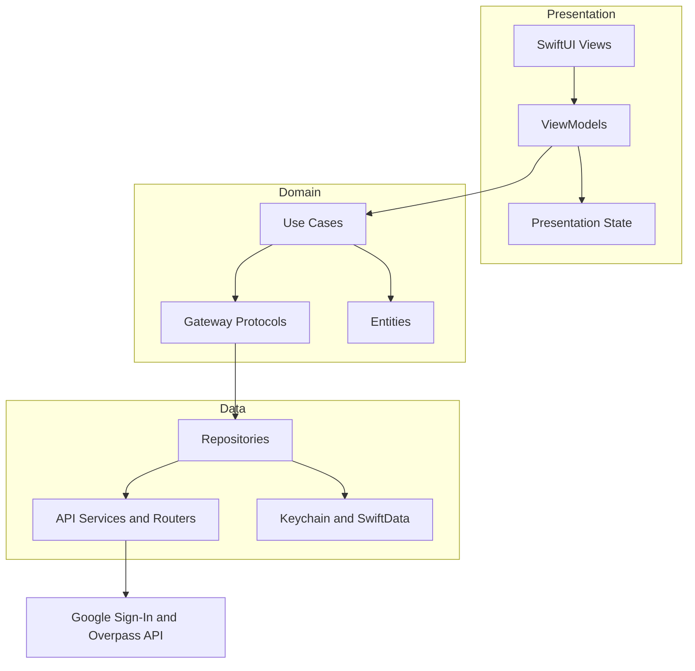
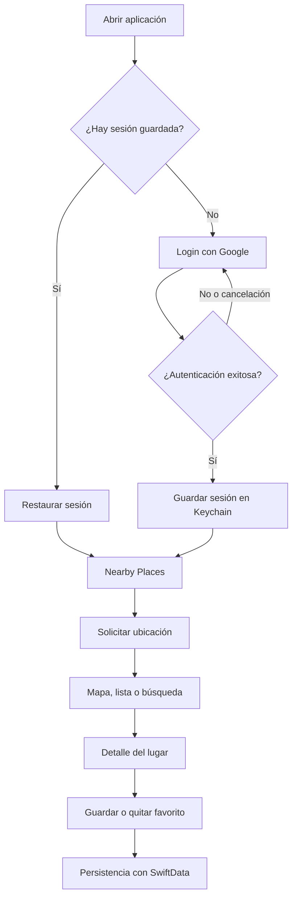

# GS Nearby Places Explorer

Aplicación iOS para descubrir lugares cercanos, buscarlos por nombre, visualizarlos en mapa o lista, consultar su detalle y guardarlos como favoritos.

## Funcionalidades

- Inicio de sesión con Google Sign-In y restauración de sesión.
- Solicitud y manejo de permisos de ubicación.
- Búsqueda de lugares cercanos con Overpass API / OpenStreetMap.
- Resultados sincronizados entre mapa y lista.
- Búsqueda con debounce, cancelación de solicitudes obsoletas y conservación de resultados previos.
- Estado de apertura: abierto, cerrado u horario no disponible.
- Vista de detalle del lugar y favoritos persistentes.

## Requisitos

- macOS con Xcode y un simulador iOS compatibles con el proyecto.
- Una configuración válida de Google OAuth para probar Google Sign-In.

## Cómo correr el proyecto

1. Clona el repositorio y entra al directorio.

   ```bash
   git clone https://github.com/guerravc/GS-NearbyPlacesExplorer.git
   cd GS-NearbyPlacesExplorer
   ```

2. Abre el proyecto en Xcode.

   ```bash
   open GS-NearbyPlacesExplorer.xcodeproj
   ```

3. Espera a que Swift Package Manager resuelva las dependencias, incluyendo `GoogleSignIn`.
4. Selecciona el scheme `GS-NearbyPlacesExplorer` y un simulador iOS.
5. Ejecuta la app con `⌘R`.
6. Inicia sesión con Google, concede el permiso de ubicación y explora los lugares desde mapa, lista o búsqueda.

## Ejecutar pruebas

Desde Xcode, usa `⌘U`. También pueden ejecutarse desde terminal:

```bash
xcodebuild test \
  -project GS-NearbyPlacesExplorer.xcodeproj \
  -scheme GS-NearbyPlacesExplorer \
  -destination 'platform=iOS Simulator,name=iPhone 17 Pro'
```

## Arquitectura

El proyecto utiliza Clean Architecture con MVVM y SwiftUI. Las vistas declaran la interfaz, los ViewModels mantienen el estado de presentación y los casos de uso coordinan las reglas de negocio sin conocer detalles de red o persistencia.



### Decisiones técnicas

- **SwiftUI + MVVM:** separa la interfaz declarativa de su estado y comportamiento de presentación.
- **Clean Architecture:** Domain depende de abstracciones; Data implementa gateways y encapsula API, Keychain y SwiftData.
- **Swift Concurrency:** las operaciones de red utilizan `async/await`; la búsqueda aplica debounce y descarta respuestas obsoletas.
- **MapKit + CoreLocation:** MapKit presenta el mapa y CoreLocation entrega la posición del usuario.
- **Overpass API / OpenStreetMap:** proporciona búsqueda y detalle de lugares sin usar una API comercial.
- **Keychain y SwiftData:** el primero persiste sesión; el segundo conserva favoritos por usuario e identificador OSM.
- **Pruebas unitarias:** cubren ViewModels, casos de uso, routers, servicios y el parser de horarios. No se incluyen XCUITests para mantener ciclos de ejecución más rápidos.

## Flujo principal



## Búsqueda

- Con el query vacío se cargan lugares cercanos por defecto.
- Con uno o dos caracteres no se realiza una petición.
- Con tres o más caracteres se espera un debounce de 350 ms.
- Al enviar la búsqueda se consulta inmediatamente.
- Una respuesta cancelada u obsoleta no puede sobrescribir resultados más recientes.
- Si una consulta falla, los resultados previos se conservan y se presenta una alerta para reintentar.

## Trade-offs relevantes

- **Overpass API pública:** no ofrece el SLA ni los límites previsibles de un proveedor comercial; por ello se conservan resultados previos y se manejan errores con alertas.
- **Datos variables de OpenStreetMap:** nombre, categoría, dirección, horario o calificación pueden estar ausentes. La interfaz utiliza fallbacks como “Horario no disponible”.
- **Parser de horarios acotado:** cubre formatos comunes, `24/7`, rangos horarios y rangos nocturnos, pero no implementa toda la especificación de `opening_hours` de OpenStreetMap.
- **Búsqueda por nombre:** depende de los datos con los que cada lugar fue registrado en OpenStreetMap y no equivale a un índice comercial exhaustivo.

## Uso de IA

Se utilizó **Antigravity IDE con el modelo gemini 3.1 pro** como asistencia de desarrollo.

La asistencia de IA abarcó, en la práctica, la mayor parte de lo especificado en los tres features documentados en `.rhoaias/plans/`:

- `feature-login-google`: Google Sign-In, restauración de sesión, Keychain, estados de login y pruebas relacionadas.
- `feature-nearby-places-view`: búsqueda con Overpass API, mapa, lista, navegación, parser de horarios, manejo de errores y pruebas.
- `feature-about-place-view`: vista de detalle, consulta de datos OSM, favoritos con SwiftData, persistencia, estados de pantalla y pruebas.

Los bloques, funciones, clases y archivos generados o modificados sustancialmente con asistencia de IA están identificados dentro del código con el comentario:

```swift
// AI-ASSISTED: generated with Antigravity IDE (gemini 3.1 pro)
```

La base del proyecto, desde el commit inicial hasta `c1b85d9e3848db4a3e3f3ab89c9c421584371dce`, fue desarrollada sin uso de IA. Esa parte se construyó utilizando XCTemplates creados personalmente para reutilizarlos como base en proyectos iOS.
